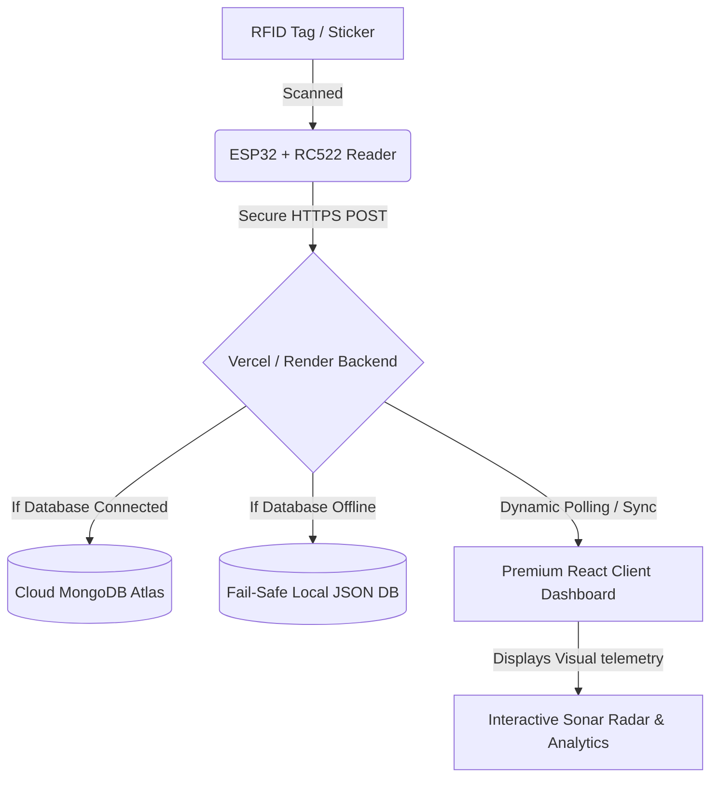

# 📡 Smart Asset Locator & Tracker (MERN + IoT ESP32)

An ultra-premium, futuristic full-stack MERN SaaS dashboard for real-time indoor asset proximity tracking. This application connects physical ESP32 microcontrollers equipped with JRD4035 RFID readers to trace household items, trace signal strength (RSSI), and display active telemetry dynamically on a glowing visual sonar radar sweep canvas.

---

## ✨ Features & Architecture

*   **🛸 Futuristic Sonar Radar View**: Blinking, color-coded proximity beacons plotted on concentric circles derived directly from real-time RSSI signal strengths (`Very Close` > -45dBm, `Nearby` > -60dBm, `Far Away` <= -60dBm).
*   **🔊 Web Audio Sonar Sweeps**: Interactive sonar node selection triggers physical dynamic sound oscillator swept beeps in your browser (pitch-sweeps from 880Hz to 440Hz).
*   **📊 Proximity Historical Charting**: Recharts-driven Area graphs mapping signal strength fluctuations over time for single traced assets.
*   **🧪 Active Background Simulator**: Built-in background ticker that mimics real-time RFID scans and random RSSI fluctuations to test dashboard visuals without needing physical hardware!
*   **📂 CSV Logs Exporter**: Instantly download complete asset telemetry log history in a clean, spreadsheets-ready CSV format.
*   **🛡️ Fail-Safe Local DB Fallback**: Robust, automatic fallback that switches the backend database to a local JSON database system if cloud MongoDB is offline, guaranteeing 100% crash-free uptime.
*   **🌓 Sleek Dark & Light Themes**: Apple-inspired glassmorphism panels, smooth spring animations, and high-contrast visible text typing across all dark/light inputs.

---

## 🗺️ System Data Flow Diagram



---

## 🔌 Hardware Configurations (ESP32 + MFRC522)

Wire your physical MFRC522 RFID module to the ESP32 SPI bus as follows:

| MFRC522 Pin | ESP32 Pin | Function |
| :--- | :--- | :--- |
| **VCC** | **3.3V** | Power Supply (Do NOT use 5V) |
| **RST** | **GPIO 22** | Reset Pin |
| **GND** | **GND** | Ground |
| **MISO** | **GPIO 19** | Master In Slave Out (SPI) |
| **MOSI** | **GPIO 23** | Master Out Slave In (SPI) |
| **SCK** | **GPIO 18** | Serial Clock (SPI) |
| **SDA (SS)** | **GPIO 21** | Slave Select / Chip Select (SPI) |

---

## 💻 Arduino C++ Telemetry Firmware

You can find the production-grade Arduino sketch, complete with secure Wi-Fi handling, JSON formatting, and HTTPS client sweeps, inside our **[ESP32 Setup Guide](./esp32_setup_guide.md)**. 

To link your deployed dashboard, simply update the server URL:
```cpp
// Deployed Vercel HTTPS Path
String serverPath = "https://your-app.vercel.app/api/items";
```

---

## 🚀 Local Quickstart Guide

Ensure you have [Node.js](https://nodejs.org/) installed.

### 1. Clone & Install Dependencies
```bash
git clone https://github.com/Soxxoro/smart-asset-tracker.git
cd smart-asset-tracker
npm run build
```

### 2. Configure Environment Variables
Create a `.env` file inside the `backend` folder:
```env
MONGO_URI=mongodb://localhost:27017/smart-locator
PORT=5000
```
*(If you leave `MONGO_URI` blank, the app will automatically run on the fail-safe filesystem database without crashing!)*

### 3. Start Development Servers
Run the full-stack app locally in concurrent dev environments:
```bash
# In root directory
npm start
```
*   Your Dashboard will open at **[http://localhost:5176/](http://localhost:5176/)**
*   Your API Server will run at **[http://localhost:5000/](http://localhost:5000/)**

---

## ⚡ One-Click Vercel Deployment

This repository is optimized for **Vercel** out of the box using our root `vercel.json` configurations.

1.  Log in to **[Vercel](https://vercel.com/)** and import your `smart-asset-tracker` repository.
2.  Leave **Root Directory** empty (Vercel will build both React and Express folders automatically).
3.  Add the environment variable **`MONGO_URI`** with your MongoDB Atlas connection string.
4.  Click **Deploy**!
